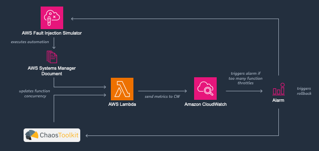
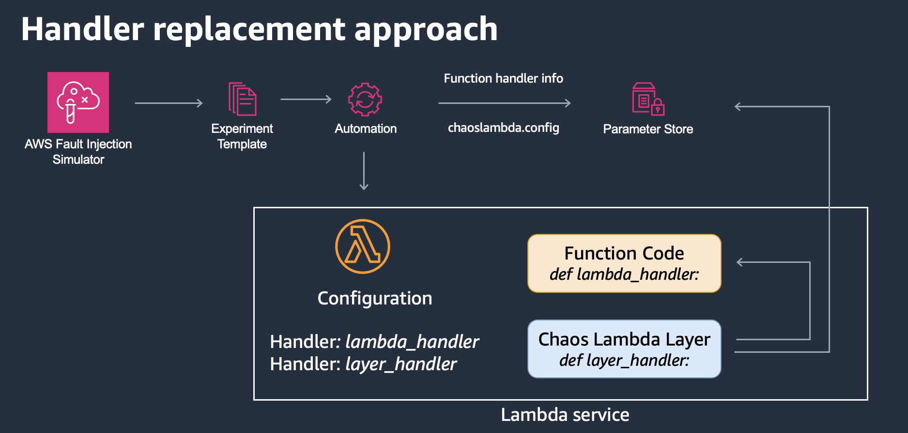
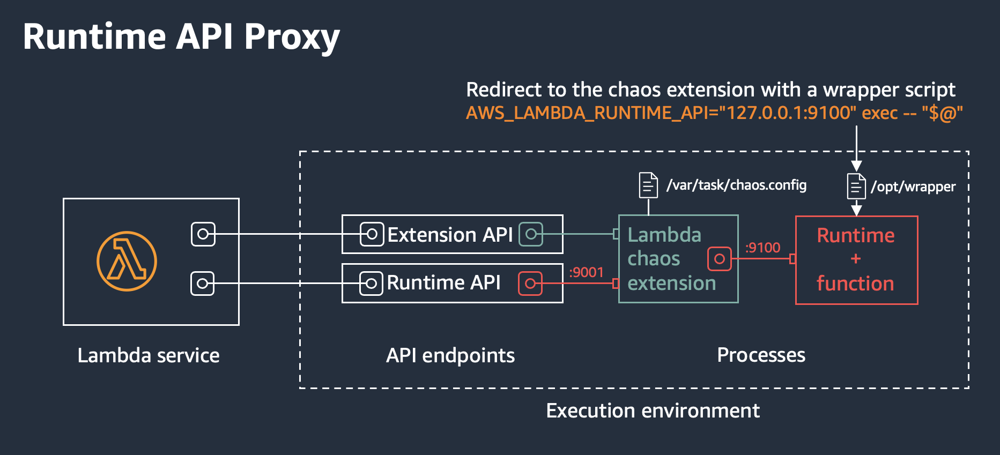

# Serverless Chaos Engineering

This project contains several demos showcasing different approaches for Serverless Chaos Engineering:

* Demo 1: Configuration manipulation (function concurrency)
* Demo 2: Handler Replacement Approach
* Demo 3: Runtime API Proxy Pattern using Extensions

## Prerequisites

- CDK Toolkit & bootstrapped AWS environment
- docker
- Chaos Toolkit (see [here](https://chaostoolkit.org/reference/usage/install/))
- chaostoolkit-aws (see [here](https://chaostoolkit.org/drivers/aws/#install))

## Deploy

```
cd cdk
npm install
cdk deploy --all
```

Optionally you can deploy the demo stacks individually. The stacks contain all resources to run the demo.
To do this just specify the stack in the deploy command, e.g. `cdk deploy ServerlessChaos-Demo-1`

## Demo 1



This demo showcases how one can manipulate the Lambda configuration. In this case we will change the concurrency level of the Lambda function. This might cause some Lambda invocations to be throttled. A CloudWatch alarm picks this up and can be use to trigger a rollback during the experiment. This demo can be carried out either using

- the AWS Fault Injection Simulator (FIS), or
- the Chaos Toolkit (see below for some details)

### Steps

1. Start the experiment
   * FIS
     * In the FIS console, select the *Set Lambda concurrency level* and start the experiment
   * chaos_toolkit
     * Go to the `/scripts/chaos_toolkit` folder and run the following script `run_demo1.sh`. Use the output values of this demo's CloudFormation stack as input
2. Check the configuration of the Lambda function, the *Reserved Concurrency* should be now set to the value defined in the [FIS experiment](cdk/lib/demos/1_one/fis/fis-concurrency-experiment.ts).
3. Trigger a rollback by setting the alarm state manually
   ```
   $ALARM_NAME=<ALARM_NAME>
   aws cloudwatch set-alarm-state --alarm-name $ALARM_NAME --state-value ALARM --state-reason TEST_ROLLBACK
   ```

## Demo 2



This demo details how to change the handler during the experiment.
It leverages the method explained in this [blog post](https://aws.amazon.com/blogs/compute/building-resilient-serverless-applications-using-chaos-engineering/).

### Steps

0. Check the Lambda function's configuration, especially check the value of the Lambda handler
1. Start the experiment
   * FIS
     * In the FIS console, select the *Lambda Handler Replacement* and start the experiment
2. Check the Lambda configuration again, see what has changed.
3. Test the Lambda function by running the function using a test event.
4. Trigger a rollback by setting the alarm state manually
   ```
   $ALARM_NAME=<ALARM_NAME>
   aws cloudwatch set-alarm-state --alarm-name $ALARM_NAME --state-value ALARM --state-reason TEST_ROLLBACK
   ```

## Demo 3



Here we make use a Lambda extension in order to inject chaos regardless of the runtime. In this demo we will use the preexisting tool [chaos-lambda-extension](https://github.com/aws-cli-tools/chaos-lambda-extension). Running this extension allows you to intercept all calls from the Runtime and the function code to the Runtime API.

### Steps

0. Check the Lambda function's configuration, especially check the environment variables and the layers.
1. Start the experiment
   * FIS
     * In the FIS console, select the *Chaos Extension Proxy Experiment* and start the experiment
2. Check the Lambda configuration again, see what has changed.
3. Test the Lambda function by running the function using a test event.
4. Trigger a rollback by setting the alarm state manually
   ```
   $ALARM_NAME=<ALARM_NAME>
   aws cloudwatch set-alarm-state --alarm-name $ALARM_NAME --state-value ALARM --state-reason TEST_ROLLBACK
   ```

## Chaos Tools

In this repository we use the following chaos tools:

- [AWS Fault Injection Simulator (FIS)](https://aws.amazon.com/fis/)
  - AWS tool to improve resiliency and performance with controlled experiments
- [Chaos Toolkit](https://chaostoolkit.org/)
  - Opensource tool to perform chaos experiments
- [chaos_Lambda](https://github.com/adhorn/aws-lambda-chaos-injection)
  - Python library to inject chaos into your Lambda function using code manipulation
- [failure-lambda](https://github.com/gunnargrosch/failure-lambda)
  - Node.js library to inject chaos into your Lambda using function code manipulation
- [Lambda Extensions](https://docs.aws.amazon.com/lambda/latest/dg/lambda-extensions.html)
  - Extensions can be used to write your own chaos tooling for AWS Lambda. In this demo will use the preexisting tool [chaos-lambda-extension](https://github.com/aws-cli-tools/chaos-lambda-extension).

### Chaos Toolkit

The Chaos Toolkit uses experiment definitions to define your chaos experiments. Check the [references](https://chaostoolkit.org/drivers/aws/) on how to interact with AWS services.

To perform an experiment which continously checks the steady-state and rolls back any changes once it's outside the tolerated ranges run the following command:

```
chaos run --hypothesis-strategy=continuously \
          --hypothesis-frequency=10 \
          --fail-fast \
          --rollback-strategy=always \
            experiment.json
```

The provided script helps to run the experiment with the correct configuration.
