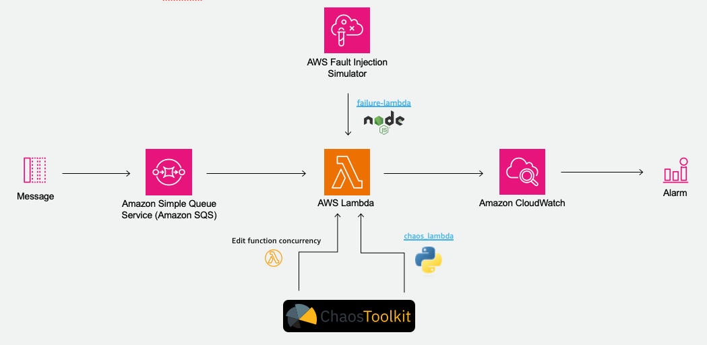

# Serverless Chaos Engineering

This a demo project showcasing various options how to inject chaos into your serverless applications.

## Application

You can deploy two different dummy applications to test the chaos tools available.
The application consists of a simple Lambda function (either with the Python or the Node.js runtime), an SQS queue serving as the trigger and additional CloudWatch alarms.



## Chaos Tools

In this repository we use the following chaos tools:

- [AWS Fault Injection Simulator (FIS)](https://aws.amazon.com/fis/)
  - AWS tool to improve resiliency and performance with controlled experiments
- [CHAOS Toolkit](https://chaostoolkit.org/)
  - Opensource tool to perform chaos experiments
- [chaos_Lambda](https://github.com/adhorn/aws-lambda-chaos-injection)
  - Python library to inject chaos into your Lambda function using code manipulation
- [failure-lambda](https://github.com/gunnargrosch/failure-lambda)
  - Node.js library to inject chaos into your Lambda using function code manipulation

## Prerequisites

- Chaos Toolkit (see [here](https://chaostoolkit.org/reference/usage/install/))
- chaostoolkit-aws (see [here](https://chaostoolkit.org/drivers/aws/#install))
- CDK

## Deploy 

```
npm install
cdk deploy --all --profile <YOUR_AWS_PROFILE>
```

Optionally you can deploy the two application stacks individually (Node.js Lambda function with *failure-lambda* or Python function with *chaos_lambda*).
To do this just specify the stack in the deploy command, e.g. `cdk deploy ServerlessChaosStack/ApplicationChaosLambda`

Note that the FIS experiments are only deployed with the *ServerlessChaosStack/ApplicationFailureLambda*.

## Perform the experiments

### Chaos Toolkit

The Chaos Toolkit uses experiment definitions to define your chaos experiments.

To perform those experiments run the following command:
```
chaos run --hypothesis-strategy=continuously \
          --hypothesis-frequency=10 \
          --fail-fast \
          --rollback-strategy=always \
            lambda_experiment.json
```

There are two predefined experiments 
- one changes the Lambda reserved concurrency 
- the other changes the configuration values for the chaos_lambda tool 

Use the provided scripts for this. Change the environment variables according to your deployed resources.

```
cd chaos_toolkit
. ./run-code-manipulation-experiment.sh
. ./run-concurrency-experiment.sh
```

### FIS

To start the FIS experiments you can simply go into the AWS console and select the FIS service.
Select the deployed experiment template to run the experiment.


## Other useful commands

* `npm run build`   compile typescript to js
* `npm run watch`   watch for changes and compile
* `npm run test`    perform the jest unit tests
* `cdk deploy`      deploy this stack to your default AWS account/region
* `cdk diff`        compare deployed stack with current state
* `cdk synth`       emits the synthesized CloudFormation template